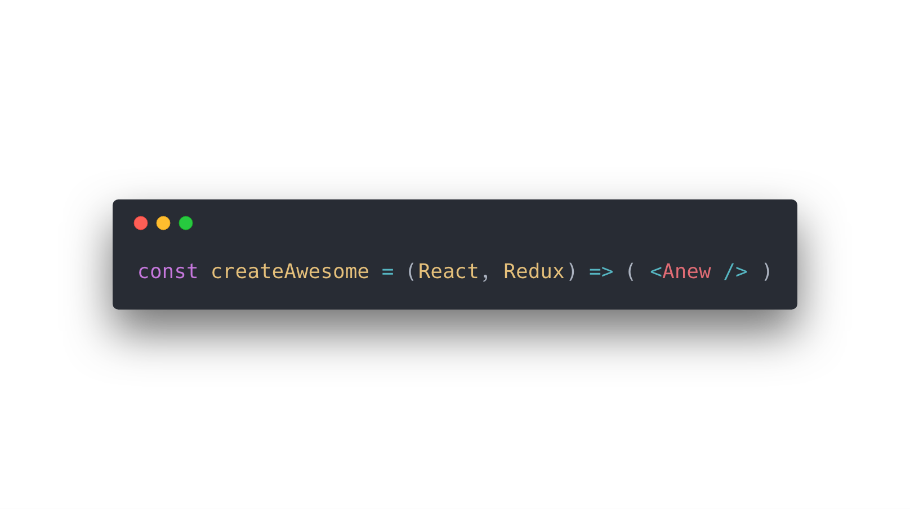

# Anew Store

> A lightweight Redux framework

**Anew** removes the boilerplate overhead **Redux** provides (for good reasons). In addition, Anew provides additional functionalities that are necessary in most if not all Redux applications. A basic use case for anew is enough to see the code reduction, structured architecture, and robustness that the framework provides.



## Installation

To install `anew` directly into your project run:

```
npm i @anew/store -S
```

for yarn users, run:

```
yarn add @anew/store
```

## Table of Contents

-   [Creating a Store](#createstore)
-   [Combining Stores](#combinestores)
-   [Creating a Test Environment](#createtestenv)
-   [Recommended Architecture](#recommend-file-structure)
-   [Common Questions](#common-questions)

## `createStore`

The `createStore` utility allows you to create a Redux store without the need to define action creators, action types, thunks, or even a reducer. Simply provide the `createStore` parameters and the rest is taken care of by anew.

```js
// @return Anew Store
createStore({
    name: String,
    state: Any,
    persist: Boolean | Object,
    reducers: Functions | Objects,
    effects: Functions,
    selectors: Functions,
    enhancer: Function,
    reducer: Function,
    actions: Functions,
})
```

### Parameters

`name`: a unique namespace specific to the store used through out the application to access the store's state object and actions.

`state`: the initial state object for the store.

`persist`: a user may add persist and rehydrate a stores data by assigning the persist property with the persist config as described in the [redux-persist](https://github.com/rt2zz/redux-persist) documentation. A use may also assign the persist property a **true** value which will use the default object created by anew. You don't need to provide the **key** property for persist since the store name is assigned as the key by anew and cannot be overwritten. Anew, also, if not defined, assigns the default storage object provided by **redux-persist**.

`reducers`: pure functions, defined under a strict namespace, that return the next state tree for a specific store. Reducers receive the store's current state tree with an optional payload list as parameters. In addition, reducers that fall under an outside namepsace can also be defined inside the store and get passed both the current and defined namespace states.

```js
createStore({
    name: 'someNameSpace',

    reducers: {
        someReducer(state, ...payload) {
            return nextStateTreeForSomeStore
        },

        otherNameSpace: {
            otherReducer(state, otherState ...payload) {
                return nextStateTreeForSomeStore
            },
        },
    },
})
```

`effects`: pure functions that handle operations that fall inside and outside the store. They are mainly used to handle **async** operations that dispatch actions upon completion. Effects receive an exposed store object with public properties.

```js
createStore({
    name: 'someNameSpace',

    effects: {
        anotherEffect(store, ...payload) {
            // Some Logic...
        },

        someEffect(store, ...payload) {
            const {
                select, // get state from selectors
                dispatch, // Dispatch reducers
                batch, // Batched dispatch for reducers
                effects, // Call effects
                actions, // Dispatch actions
                core, // Access ^ aboveproperties at core (root) store level
                persistor, // Dispatch persistor action
            } = store

            effects.anotherEffect(...payload) // no need to pass store

            // Core Properties (Example)
            core.effects.otherNameSpace.otherEffect(...payload)
            core.dispatch.otherNameSpace.otherReducer(...payload)

            core.batch.otherNameSpace.otherReducer(...payload)
            core.batch.done()

            core.select.otherNameSpace.otherSelector(...payload)
            core.actions.otherNameSpace.otherAction(...payload)
        },
    },
})
```

`selectors`: pure functions that return a state slice selector or a derived state selector. Derived state selectors are memoized using [reselect](https://github.com/reduxjs/reselect).

```js
createStore({
    name: 'someNameSpace',

    state: {
        someStateProp: 1,
        anotherStateProp: 2,
    },

    selectors: {
        // Passing a string as the first argument creates a prop selector
        // You may also assign any default value of any type
        someProp: store => store.create('someProp', 'defaultValue'),

        // Passing one function to the store.create method generates a simple object lookup selector
        // No memoization is done for these selectors
        someStateProp: store => store.create(state => state.someStateProp),

        anotherStateProp: store =>
            store.create(
                /**
                 * Simple Selector
                 * @param  { Object } state      Local Namespace State
                 * @param  { Object } coreState  Core (Root) App State. This prop
                 *                               does not exist if no root store
                 *                               exits
                 * @param  { ...Any } payload    List of arguments
                 */
                (state, coreState, ...payload) => {
                    if (coreState.otherNameSpace.otherStateProp) {
                        return state.someStateProp
                    }

                    return true
                }
            ),

        // Passing two parameters or a list of functions generates a memoized selector
        // Using the reselect api
        totalStateProp: store =>
            store.create(
                [
                    store.select.someStateProp,
                    store.select.anotherStateProp,
                    store.select.someProp,

                    store.core.otherNameSpace.otherSelectorName,
                ],
                (someStateProp, anotherStateProp, someProp, otherBoolProp) => {
                    return otherBoolProp && someProp === 'something'
                        ? someStateProp + anotherStateProp
                        : 0
                }
            ),
    },
})
```

`enhancer`: An optional parameter to enhance the store using Redux middlewares.

`reducer`: an optional property for using a user defined reducer. The **createStore** utility automatically generates a reducer for you to accommodate the **anewStore api**. A user could, however, provide their own reducer, which is merged with the generated anewStore reducer and state. This is useful for using packages that follow the standard redux api inside an anew application. A perfect example, is integrating the [connected-react-router](https://github.com/supasate/connected-react-router) package inside an anew store.

`actions`: are pure functions that return an action object (`{ type, payload }`). They are mainly used for a user defined **reducer** that has user defined action types.

### Example

```js
// stores/counter.js
import createStore from '@anew/store'

export const counterStore = createStore({
    name: 'counter',

    state: {
        count: 0,
    },

    reducers: {
        increment(state, addition = 1) {
            return {
                count: state.count + addition,
            }
        },

        // Outside Nampesace
        list: {
            // Both state objects are passed as paramaters
            push(state, list, addition = 1) {
                return {
                    count: state.count + list.items.length + addition,
                }
            },
        },

        // You can use with third party stores as well
        '@@router': {
            LOCATION_CHANGE() {
                // logic
            },
        },
    },

    effects: {
        async incrementDelayed(store, addition) {
            await setTimeout(() => {
                store.dispatch.increment(addition)

                // The following is equivalent to:
                // 1. store.dispatch({
                //      type: 'counter:increment',
                //      payload: [ addition ]
                //    })
                //
                // 2. store.batch.increment(addition)
                //    store.batch.done()
                //
                // 3. store.batch([
                //      { type: 'counter:inc', payload: [ addition] }
                //    ])
                //    store.batch.done()
                //
                // 4. store.batch({
                //      type: 'counter:inc',
                //      payload: [ addition]
                //    })
                //    store.batch.done()
            }, 1000)
        },
    },
})

// returns: { count: 0 }
counterStore.getState()

// new state tree: { count: 1 }
counterStore.dispatch.reducers.increment(1)

// new state tree: { count: 10 }
counterStore.dispatch({ type: 'counter:inc', payload: [9] })

// new state tree: { count: 11 }
counterStore.dispatch.effects.incrementDelayed(1).then(() => {
    console.log('Some Logic')
})

// new state tree: { count: 13 } executes one dispatch (one re-render)
counterStore.dispatch.batch.increment(1)
counterStore.dispatch.batch.increment(1)
counterStore.dispatch.batch.done()

// new state tree: { count: 15 }
counterStore.dispatch.batch([
    { type: 'counter:inc', payload: [1] },
    { type: 'counter:inc', payload: [1] },
])
counterStore.dispatch.batch.done()
```

### Example: With User Defined Reducer

```js
import createStore from '@anew/store'
import { routerReducer, routerActions } from 'react-router-redux'

export const routerStore = createStore({
    name: 'router',

    state: {
        isAuthenticated: false,
    },

    reducer: routerReducer,

    actions: routerActions,

    reducers: {
        authenticated() {
            return {
                isAuthenticated: true,
            }
        },
    },
})

// returns: { isAuthenticated: false, location: { ... } }
// The state is a merge of the two states: anewStore state and routerReducer state.
routerStore.getState()

// new state tree: { isAuthenticated: false, location: { pathname: '/home', ... } }
routerStore.dispatch.actions.push('/home')

// new state tree: { isAuthenticated: true, location: { ... } }
routerStore.dispatch.reducers.authenticated()
```

## `combineStores`

The `combineStores` utility is very similar to the `combineReducer` utility provided by Redux. The only difference is it combines multiple stores rather than combining multiple reducers. This combination updates each store's api references to point to the new combined store reference. This however, does not change the store shape for each given store. Methods like `getState()` still return the state shape for each store.

```js
// @return Combnined Anew Store
combineStores({
    name: String,
    stores: Array[AnewStores],
    enhancer: Function,
})
```

### Parameters

`name`: a unique namespace for the newly created store combination.

`stores`: an array of anew stores to combine.

`enhancer`: An optional parameter to enhance the new combined store using Redux middlewares.

### Example

```js
// app/store.js
import createStore, { combineStores } from '@anew/store'

const counterStore = createStore({
    name: 'counter',

    state: {
        count: 0,
    },

    reducers: {
        increment: state => ({
            count: state.count + 1,
        }),
    },
})

// Notice, the combination will
// take care of store creation if
// the store has not already been
// created. However, this store
// can not be used directly since the
// store creation happens within the combination
// and is not exposed to the application.
const otherStore = {
    name: 'other',

    state: {
        someBool: false,
    },

    reducer: {
        toggle: state => ({
            someBool: !state.someBool,
        }),
    },
}

const rootStore = combineStores({
    name: 'root',

    stores: [counterStore, otherStore],
})

// returns: { counter: { count: 0 } }
rootStore.getState()

// new state tree: { counter: { count: 1 } }
rootStore.dispatch.reducers.counter.increment(1)

// new state tree: { counter: { count: 10 } }
rootStore.dispatch({ type: 'counter:increment', payload: [9] })

// After Combination using `counterStore`
// new state tree: { counter: { count: 11 } }
counterStore.dispatch.reducers.increment(1)
```

## `createTestEnv`

The `createTestEnv` utility allows you to track a store's state tree changes. After a sequence of actions executed using the anew store's api you expect a specific state tree. Having action creators and state getters coupled together in the api makes this much easier. The utility, simply returns a function (bound to a specific store) that resets the store to initial state, when called, and returns that store object. You may also execute this function before each test using a method like `beforeEach` provided by jest and other testing suites and use the store object directly.

```js
// @return Store Creator
createTestEnv(store)
```

### Parameters

`store`: an anew store

### Example

```js
// test/stores/counter.test.js
import { createTestEnv } from '@anew/store'
import counterStore from 'stores/counter'

const newTestEnv = createTestEnv(counterStore)

test('inital state', () => {
    const store = newTestEnv()
    const state = store.getState()

    expect(state).toEqual({
        count: 0,
    })
})

test('increment by one', () => {
    const store = newTestEnv()

    store.dispatch.reducers.increment(1)

    const state = store.getState()

    expect(state).toEqual({
        count: 1,
    })
})
```

# Recommend File Structure

This is merely a recommendation for how you could structure your anew application. Anew is composed of all pure functions making it very flexible when it comes to how you architect your application. No need to go through the hassle of binding methods, you can rest assure, each method will always receive the expected parameters.

`/stores`: contains all application stores

`/stores/index.js`: combination of all application stores

```js
// /stores/index.js

import { combineStores } from '@anew/store'

/**
 | ------------------
 | Stores
 | ------------------
 */

import someStore from './someStore/someStore'
import otherStore from './otherStore/otherStore'

/**
 | ------------------
 | Combination
 | ------------------
 */

export default combineStores({
    name: 'rootStore',

    stores: [someStore, otherStore],
})
```

`/stores/someStore`: contains all someStore related files

`/stores/someStore/someStore.js` : someStore creation file

```js
// /stores/someStore/someStore.js

import createStore from '@anew/store'

import state from './someStore.state'
import * as reducers from './someStore.reducers'
import * as effects from './someStore.effects'

export default createStore({
    name: 'someStore',

    state,
    reducers,
    effects,
})
```

`/stores/someStore/someStore.state.js`: someStore initial state and object lookups

```js
// /stores/someStore/someStore.state.js

export default {
    someBoolProp: false,
}

export const someBoolPropSelector = ({ someStore }) => someStore.someBoolProp
```

`/stores/someStore/someStore.selectors.js`: someStore memoized selectors

```js
// /stores/someStore/someStore.selectors.js

import { createSelector } from 'reselect'

import { someBoolPropSelector } from './someStore.state'
import { otherBoolPropSelector } from 'stores/otherStore/otherStore.state'

export const someAdvancedSelector = createSelector(
    [someBoolPropSelector, otherBoolPropSelector],
    (someBoolProp, otherBoolProp) => {
        return someBoolProp || otherBoolProp
    }
)
```

`/stores/someStore/someStore.reducers.js`: someStore state reducers

```js
// /stores/someStore/someStore.reducers.js

import * as otherStore from './someStore.reducers.otherStore'

/**
 | ------------------
 | Inner Reducers
 | ------------------
 */

export const someToggleReducer = state => ({
    someBoolProp: !state.someBoolProp,
})

/**
 | ------------------
 | Outer Reducers
 | ------------------
 */

export { otherStore }
```

`/stores/someStore/someStore.reducers.otherStore.js`: someStore state reducers defined under another namespace

```js
// /stores/someStore/someStore.reducers.otherStore.js

export const otherReducer = (state, otherState) => ({
    someBoolProp: state.someBoolProp || otherState.otherBoolProp,
})
```

`/stores/someStore/someStore.effects.js`: someStore effects

```js
// /stores/someStore/someStore.effects.js

import { someAdvancedSelector } from './someStore.selectors'

export const someEffect = ({ effects, getState }) => {
    const state = getState()
    const someAdvanced = someAdvancedSelector(state)

    effects.someOtherEffect(someAdvanced)
}

export const someOtherEffect = ({ dispatch }, someAdvanced) => {
    setTimeout(() => {
        dispatch.someToggleReducer(someAdvanced)
    }, 1000)
}
```

## Common Questions

> How reliable is @anew/store?

There are over **1000 lines** of code thoroughly testing the `@anew/store` package. The package also passes all of the relevant redux tests used in the `redux` package. That being said, if you feel there are any issues with the package, please don't hesitate to create a **New Issue** in the _Issues_ tab above.

> Can I use redux or a third party redux packages with @anew/store?

Yes! `@anew/store` includes an optional traditional redux implementation. Store properties like `actions` and `reducer` where primarily made for that reason. You may for example use the `connected-react-router` redux package in the following way:

```js
import { connectRouter, routerActions } from 'connected-react-router'
import createStore from '@anew/store'
import createBrowserHistory from 'history/createBrowserHistory'

const history = createBrowserHistory()

export default createStore({
    name: 'router',
    actions: routerActions,
    reducer: connectRouter(history),
    state: {
        action: '',
        location: {
            hash: '',
            pathname: '/',
            search: '',
        },
    },

    // You may also use anew store properties
    selectors: {...},
    reducers: {...},
    effects: {...},
})
```
